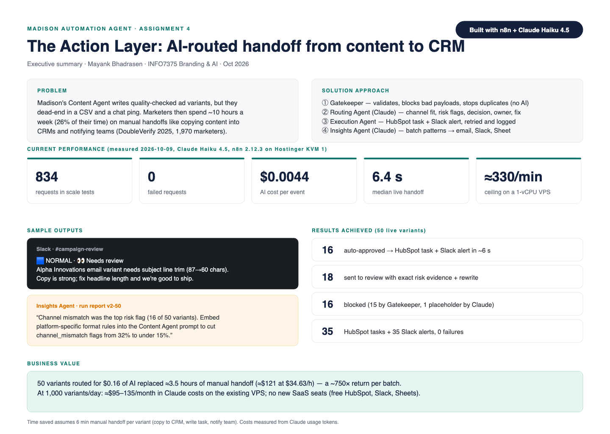
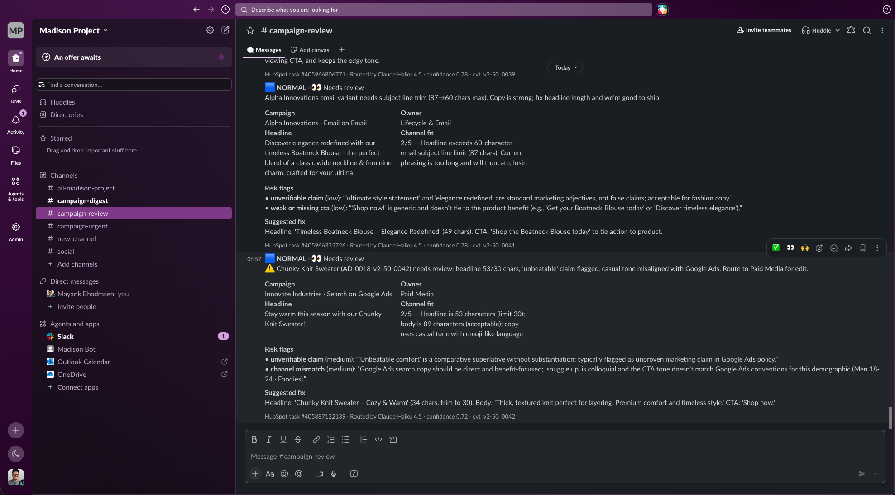
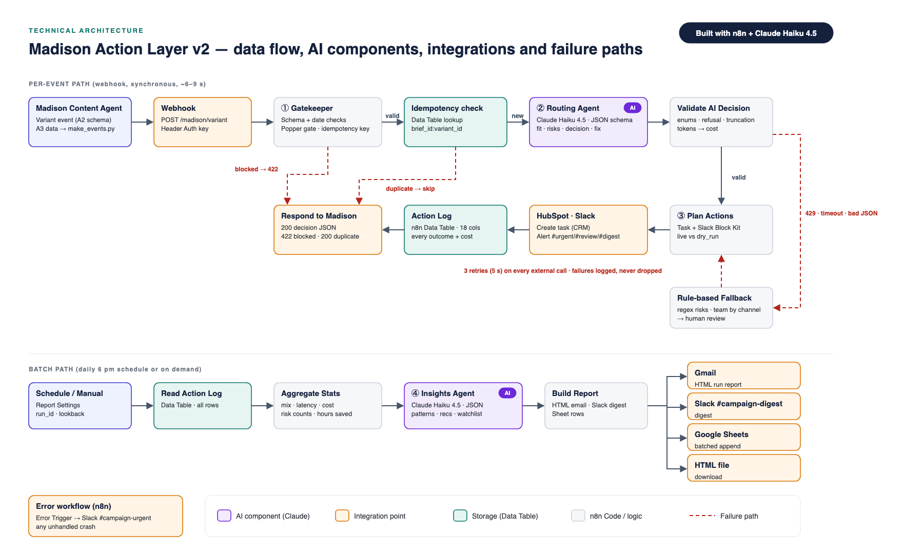
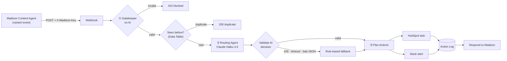
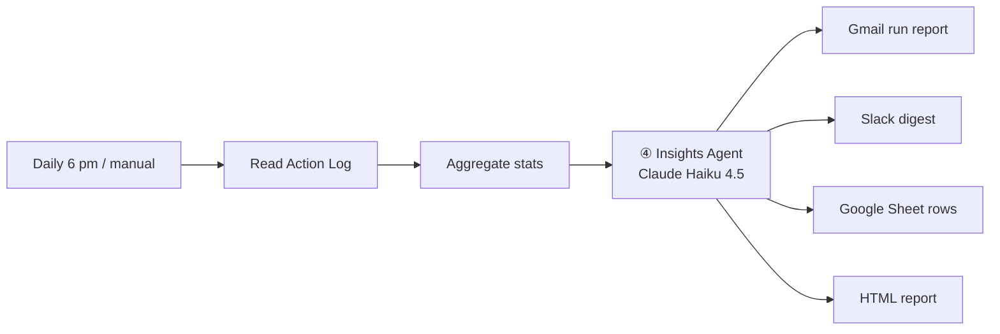
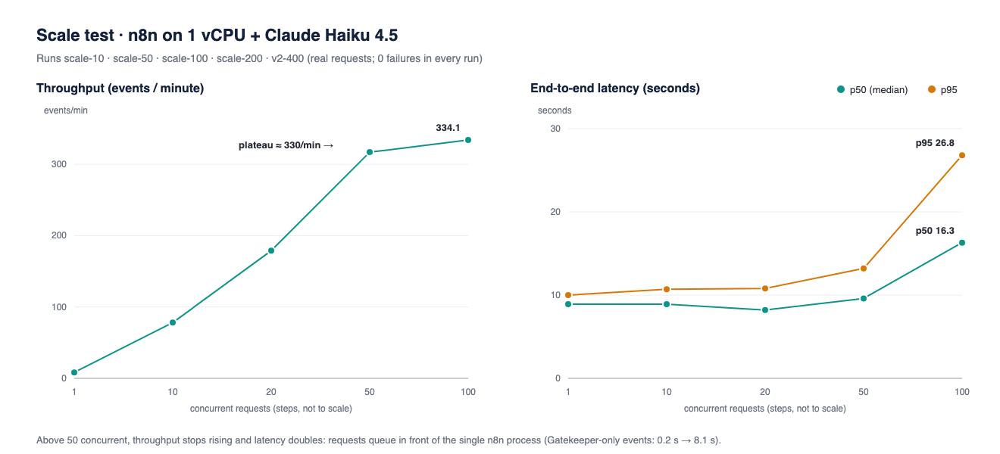

# Madison Action Layer v2

**An AI routing layer that turns marketing content into real work: decisions, CRM tasks and team alerts, in about 7 seconds per ad.**

Built with **n8n** (self-hosted) and **Claude Haiku 4.5**, connected to **HubSpot, Slack, Google Sheets and Gmail**. Assignment 4 of INFO7375 *Branding & AI* (Northeastern University) by Mayank Bhadrasen. It extends the open-source [Madison](https://github.com/Humanitariansai/Madison) AI marketing framework.



---

## The problem

Madison's Content Agent writes ad variants and checks their quality. Then they stop: they sit in a CSV file or a chat message. Someone still has to read each variant, decide whether it can go live, write a CRM task, and tell the right team. Marketers spend about **10 hours a week (26% of their time)** on manual handoffs like this (DoubleVerify 2025 survey of 1,970 marketers).

## What this project does

Every new ad variant is sent to a webhook. Within seconds it is:

1. **Checked** (no AI): broken or low-quality payloads and duplicates are stopped straight away, at no AI cost.
2. **Judged by Claude:** how well it fits its channel (score 1–5, against real platform limits), which risks it carries (each quoting the exact words), and a decision (`auto_approve`, `needs_review` or `block`) with a priority, an owner team, and a rewritten headline or CTA when needed.
3. **Acted on:** a **HubSpot task** is created and a **Slack alert** goes to `#campaign-urgent`, `#campaign-review` or `#campaign-digest`. Every outcome is logged.
4. **Summarised:** a daily (or on-demand) **Insights Agent** reads the whole batch and sends a run report by email, Slack and Google Sheets. The report contains patterns, recommendations and a watchlist.

### Same ad, before and after

| Assignment 3 (data pipeline) | Assignment 4 (this repo) |
|---|---|
| Stored the ad *"Discover Harem Pants!"* as one row in a CSV. No decision, no owner, no task. | Routed it to **needs review**, owner **Social & Influencer**, channel fit **4/5**. It flagged a medium "brief mismatch" (fashion copy for a *Tech Enthusiasts* audience), suggested a reframed hook, created **HubSpot task #405859715793** and posted to **#campaign-review**, all in about 7 s. |



---

## Results at a glance

Everything below was measured on 2026-10-09 with real HTTP requests against the production webhook.

| Metric | Result |
|---|---|
| Requests sent across all tests | **834** |
| Failed requests (HTTP errors, timeouts, crashes) | **0** |
| AI cost per routed ad | **$0.0044** (≈2,200 input + 470 output tokens) |
| Median time from webhook to Slack and HubSpot (50 live ads) | **6.4 s** |
| Throughput ceiling on a 1-vCPU / 4 GB VPS | **≈330 events / minute** |
| Total Claude spend for the whole project | **$2.63** |

**One real batch of 50 ads (run `v2-50`):** 16 auto-approved · 18 sent to human review with evidence and a rewrite · 1 blocked by Claude (placeholder text) · 15 blocked by the Gatekeeper. That produced 35 HubSpot tasks and 35 Slack alerts with 0 failures, for $0.16 of AI. Doing the same by hand takes about 3.5 hours (≈$121, assuming 6 minutes per ad at $34.63/h).

---

## How it works







### The four agents

| # | Agent | AI? | What it does |
|---|---|---|---|
| ① | **Gatekeeper** | No | Checks the event against the schema and the dates. Blocks ads that failed Madison's *Popper* quality gate or have no CTA. Builds the idempotency key `brief_id:variant_id` and looks it up in an n8n Data Table. |
| ② | **Routing Agent** | Claude Haiku 4.5 | Reads the ad, its campaign (channel, audience, ROI) and optional market context. It must answer in a **strict JSON schema** (`output_config.format`) that holds the decision, priority, owner team, Slack channel, channel fit, risk flags with evidence, rationale, suggested fix, HubSpot task text, Slack message and confidence. |
| ③ | **Execution Agent** | No | Creates the HubSpot task, posts a Slack Block Kit alert, logs every outcome (including partial failures) and replies to the caller. `dry_run` events skip the external tools so load tests don't spam real channels. |
| ④ | **Insights Agent** | Claude Haiku 4.5 | Runs once per batch. Turns the action log into a headline, 3 patterns, 3 recommendations and a watchlist, based only on the batch numbers. Its recommendations feed back into the Content Agent's prompt. |

### Guardrails: the AI is never trusted blindly

- **Schema plus validator:** each Claude answer is checked for API errors, refusals (`stop_reason`), truncation (`max_tokens`), JSON parse failures, values outside the allowed set and missing fields. If any check fails, a **rule-based fallback router** takes over (regex risk checks, and the team is chosen by channel). The ad still goes to human review, so nothing is lost.
- **Instructions inside ad copy are ignored:** the system prompt treats ad text as untrusted data.
- **Retries everywhere:** every external call (Claude, HubSpot, Slack, Gmail, Sheets) retries 3 times, 5 s apart, then continues instead of crashing.
- **Error workflow:** any unhandled crash is posted to `#campaign-urgent` with the failing node and the error message (`workflow_v2_error_handler.json`).
- **No secrets in the repo:** the webhook is protected by a Header Auth key. All API keys live in n8n credentials, and the exported JSON only references them by name.

**Tested live:** in run `fallback-1`, the Claude model ID was deliberately broken. The workflow retried, detected the failure, routed the ad with the fallback rules, created the HubSpot task, posted "⚠️ AI router unavailable" to Slack and returned HTTP 200 in 11.8 s at $0 AI cost (`screenshots/17.png`, `18.png`, `19.png`).

---

## Scale testing

A Python load generator (`scale_test/loadtest.py`) fired real requests from a laptop at the production webhook. About 30% of every batch was invalid on purpose, and every 25th event was a repeat, so the blocking and duplicate paths were tested under load too.

| Requests | Concurrency | Wall clock | Throughput | Latency p50 / p95 | Failures | Claude cost |
|---|---|---|---|---|---|---|
| 1 | 1 | 9.5 s | — | 9.5 / 9.5 s | 0 | $0.0051 |
| 10 | 1 | 71.9 s | 8 / min | 8.9 / 10.0 s | 0 | $0.041 |
| 50 | 10 | 28.3 s | 106 / min | 6.4 / 9.2 s | 0 | $0.156 |
| 100 | 20 | 33.5 s | 179 / min | 8.2 / 10.8 s | 0 | $0.331 |
| 200 | 50 | 37.9 s | 317 / min | 9.6 / 13.2 s | 0 | $0.671 |
| 400 | 100 | 71.8 s | 334 / min | 16.3 / 26.8 s | 0 | $1.166 |



**What breaks first:**
1. **n8n intake on 1 vCPU.** Above 50 concurrent requests, throughput stops rising and latency doubles. Requests queue for about 7 s before n8n starts on them. Fix: n8n queue mode (Redis plus 2–3 workers).
2. **Duplicates arriving at the same moment.** Duplicates sent one after another are caught in 0.19 s at $0, but two identical events arriving together are both processed, because the check-then-insert isn't atomic. Fix: a unique constraint on the key, or Redis `SETNX`.
3. **Not reached:** Anthropic rate limits (0 × 429), Slack and HubSpot limits, memory and timeouts.

**Estimated running cost at 1,000 ads/day:** ≈ **$95–135 / month** in Claude usage on the existing VPS. Slack, HubSpot's free CRM, Sheets and Gmail cost nothing.

Full details: [`scale_test_results.md`](scale_test_results.md).

---

## Repository guide

| Path | What's inside |
|---|---|
| [`workflow_v2.json`](workflow_v2.json) | The main n8n workflow (34 nodes plus 5 sticky notes): Gatekeeper → Routing → Execution, the Insights report and a one-time setup trigger. Contains no credentials. |
| [`workflow_v2_error_handler.json`](workflow_v2_error_handler.json) | n8n error workflow: Error Trigger → Slack `#campaign-urgent`. |
| [`demo_walkthrough.pdf`](demo_walkthrough.pdf) | Walkthrough of 11 annotated screenshots: how the AI decides, what it produces, how it fails safely and how far it scales. |
| [`output_gallery.pdf`](output_gallery.pdf) | 14 real outputs, each with what it is, where it went and a quality check. |
| [`scale_test_results.md`](scale_test_results.md) | Load-test results, what breaks first, production readiness and monitoring. |
| [`workflow_run_and_error_handling.md`](workflow_run_and_error_handling.md) | One complete run from start to finish, what the AI decides, and how each failure is handled. |
| [`outputs/`](outputs/) | Run report (HTML and PDF), action-log CSV exports, gallery PDF and 11 screenshots of the real Slack, HubSpot, email, Sheet and Data Table outputs. |
| [`screenshots/`](screenshots/) | All 19 screenshots from real runs: Slack, HubSpot, Gmail, Google Sheets, n8n and terminal. 14 appear in the output gallery (1–13, 17); the n8n canvas and node views (14–16, 18, 19) appear in the walkthrough. |
| [`scale_test/`](scale_test/) | `make_events.py` (builds test events), `loadtest.py` (fires them), the generated `events_*.jsonl` files and raw `results/` (one CSV per request and one JSON summary per run). |
| [`figma/`](figma/) | Board assets: executive summary, architecture, scale chart and before/after (SVG and PNG). |
| [`_build/`](_build/) | Generator scripts. `build_v2.py` assembles the workflow JSON from the Code-node sources in `_build/js/`, and `gen_pdfs.py` / `gen_figma.py` produce the PDFs and board assets. |
| [`SETUP_ACCOUNTS.md`](SETUP_ACCOUNTS.md) · [`IMPORT_AND_RUN.md`](IMPORT_AND_RUN.md) | Step-by-step account, credential and import guides. |

### Example input and output

The webhook receives one event per ad variant. The full schema is in any `scale_test/events_*.jsonl` file.

```json
{
  "event_id": "evt_demo-1_0001",
  "brief_id": "HS-0001",
  "variant_id": "AD-0001-demo-1-0001",
  "headline": "Discover Harem Pants!",
  "body": "Unique, stylish bohemian vibes with a dropped crotch & loose legs. Comfy meets chic - elevate your wardrobe.",
  "cta": "Limited stock - shop now!",
  "popper_pass": true,
  "campaign": { "company": "TechCorp", "channel": "Facebook", "audience": "All Ages · Tech Enthusiasts", "roi": 5.58 },
  "brief": { "title": "GTM tech stack: What it is and how to build one", "source": "HubSpot Marketing Blog" },
  "mode": "live"
}
```

…and the result logged for it (from `scale_test/results/demo-1.csv`):

```
event_id,http_status,seconds,status,decision,ai_status,cost_usd
evt_demo-1_0001,200,7.641,completed,needs_review,ai,0.004569
```

---

## Run it yourself

**You need:** n8n 2.x (self-hosted or cloud), an Anthropic API key, and free Slack, HubSpot and Google accounts.

1. **Credentials:** create them in n8n (Anthropic, Slack, HubSpot App Token, Google Sheets, Gmail, plus a Header Auth credential named `X-Madison-Key`). See [`SETUP_ACCOUNTS.md`](SETUP_ACCOUNTS.md).
2. **Import:** import `workflow_v2_error_handler.json`, then `workflow_v2.json`. Pick a credential on each node marked ⚠️, set `report_email` in **Report Settings**, and choose the error workflow in the workflow settings. See [`IMPORT_AND_RUN.md`](IMPORT_AND_RUN.md).
3. **Setup:** run **Run Once: Setup** (creates the `madison_action_log` Data Table), then **Publish** the workflow.
4. **Send events:**
   ```bash
   cd scale_test
   export MADISON_WEBHOOK_URL="https://<your-n8n>/webhook/madison/variant"
   export MADISON_WEBHOOK_KEY="<your Header Auth value>"
   python3 loadtest.py events_demo-1.jsonl --concurrency 1      # one live event
   python3 loadtest.py events_v2-50.jsonl --concurrency 10      # a 50-event batch
   ```
   Expect `"completed": 1`, a Slack alert, a HubSpot task and a new row in the Data Table.

> `make_events.py` builds new event files from the Assignment 3 dataset (`../Assignment_3/madison_a3_records.csv`), which isn't in this repo. The pre-generated `events_*.jsonl` files work without it. The scripts use only the Python standard library.

---

## Known limitations and next steps

- Two identical events arriving at the same moment can both be processed (see *What breaks first*).
- One n8n process on 1 vCPU tops out at ≈330 events/min. Queue mode is the next step for multi-team volume.
- HubSpot tasks aren't assigned to named users yet, because the free test account has no extra users.
- The test data pairs synthetic campaigns with real ads, so Claude sometimes flags audience mismatches that a real brief wouldn't have. Those ads go to human review rather than being blocked.

---

## Built with

n8n 2.12.3 (self-hosted on a Hostinger KVM 1 VPS) · Claude Haiku 4.5 via the Anthropic Messages API (structured outputs) · HubSpot CRM (free) · Slack · Google Sheets · Gmail · Python 3 (standard library only).

**Author:** Mayank Bhadrasen, MS Information Systems, Northeastern University · [mayankbhadrasen.com](https://mayankbhadrasen.com)
